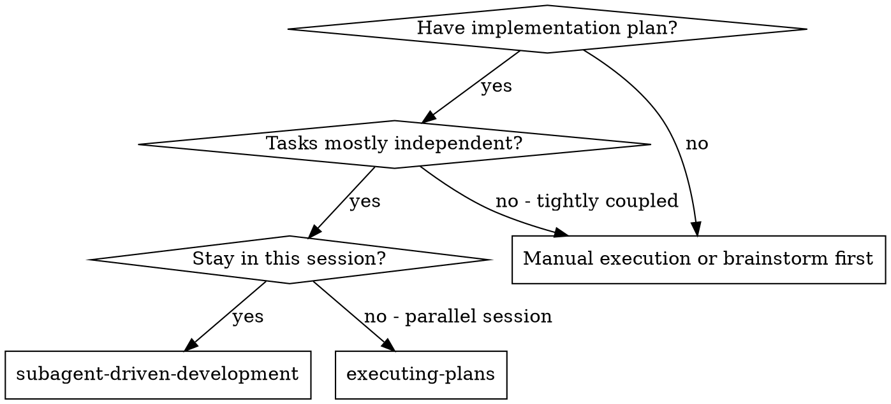
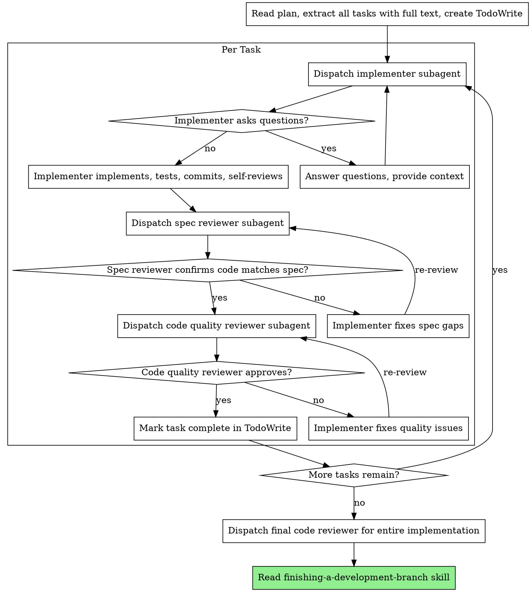

# Subagent-Driven Development

Execute plan by dispatching fresh subagent per task w/ two-stage review after each: spec compliance first, then code quality.

**Why subagents:** Delegate to specialized agents w/ isolated context. Craft instructions/context precisely → they stay focused, succeed. Never inherit your session context — construct exactly what they need. Preserves your context for coordination.

**Core principle:** Fresh subagent per task + two-stage review (spec then quality) = high quality, fast iteration

## When to Use

## The Process

## Model Selection

Use least powerful model that handles role → conserve cost, increase speed.

- **Mechanical impl** (isolated fns, clear specs, 1-2 files): fast/cheap model
- **Integration/judgment** (multi-file, pattern matching, debugging): standard model
- **Architecture/design/review**: most capable model

**Complexity signals:**
- 1-2 files w/ complete spec → cheap
- Multi-file w/ integration → standard
- Design judgment / broad codebase understanding → most capable

## Handling Implementer Status

Four statuses:

**DONE:** Proceed to spec compliance review.

**DONE_WITH_CONCERNS:** Read concerns. Correctness/scope → address before review. Observations (e.g., "file getting large") → note, proceed.

**NEEDS_CONTEXT:** Provide missing context, re-dispatch.

**BLOCKED:** Assess:
1. Context problem → more context, re-dispatch same model
2. Needs more reasoning → re-dispatch w/ more capable model
3. Task too large → break into smaller pieces
4. Plan wrong → escalate to user

**Never** ignore escalation or force same model to retry w/o changes.

## Prompt Templates

In `.claude/skills/subagent-driven-development/`:
- `implementer-prompt.md`
- `spec-reviewer-prompt.md`
- `code-quality-reviewer-prompt.md`

## Red Flags

**Never:**
- Start impl on main/master w/o explicit user consent
- Skip reviews (spec OR quality)
- Proceed w/ unfixed issues
- Dispatch multiple implementation subagents in parallel (conflicts)
- Make subagent read plan file (provide full text)
- Skip scene-setting context (subagent needs to know where task fits)
- Ignore subagent questions (answer before proceeding)
- Accept "close enough" on spec compliance
- **Start code quality review before spec compliance ✅** (wrong order)
- Move to next task while either review has open issues

**If reviewer finds issues:**
- Same implementer subagent fixes
- Reviewer re-reviews
- Repeat until approved
- Don't skip re-review

## Integration

**Required workflow skills:**
- **using-git-worktrees** — REQUIRED: isolated workspace before starting
- **writing-plans** — creates plan this skill executes
- **requesting-code-review** — template for reviewer subagents
- **finishing-a-development-branch** — complete after all tasks

**Subagents use:**
- **test-driven-development** — subagents follow TDD per task
