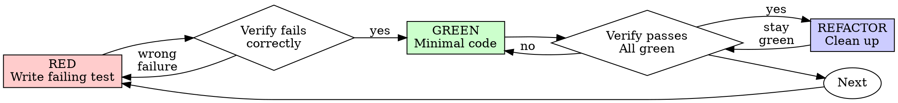

# Test-Driven Development (TDD)

## Overview

Write test first. Watch it fail. Write minimal code to pass.

**Core principle:** Didn't watch test fail → don't know if it tests right thing.

**Violating the letter = violating the spirit.**

## When to Use

**Always:** new features, bug fixes, refactoring, behavior changes.

**Exceptions (ask user):** throwaway prototypes, generated code, config files.

Thinking "skip TDD just this once"? Stop. Rationalization.

## The Iron Law

```
NO PRODUCTION CODE WITHOUT A FAILING TEST FIRST
```

Wrote code before test? Delete it. Start over.

**No exceptions:**
- Don't keep as "reference"
- Don't "adapt" while writing tests
- Don't look at it
- Delete means delete

## Red-Green-Refactor



### RED - Write Failing Test

One minimal test showing what should happen.

**Requirements:** one behavior, clear name, real code (no mocks unless unavoidable).

### Verify RED - Watch It Fail

**MANDATORY. Never skip.**

Confirm: test fails (not errors), failure message expected, fails b/c feature missing (not typos).

**Passes?** Testing existing behavior. Fix test.

**Errors?** Fix error, re-run until fails correctly.

### GREEN - Minimal Code

Simplest code to pass. No features, refactors, "improvements" beyond test.

### Verify GREEN - Watch It Pass

**MANDATORY.**

Confirm: test passes, others still pass, output pristine (no errors/warnings).

**Fails?** Fix code, not test.

**Others fail?** Fix now.

### REFACTOR - Clean Up

After green only: remove duplication, improve names, extract helpers.

Keep tests green. No new behavior.

### Repeat

Next failing test for next feature.

## Good Tests

| Quality | Good | Bad |
|---------|------|-----|
| **Minimal** | One thing. "and" in name? Split it. | `test('validates email and domain and whitespace')` |
| **Clear** | Name describes behavior | `test('test1')` |
| **Shows intent** | Demonstrates desired API | Obscures what code should do |

## Common Rationalizations

| Excuse | Reality |
|--------|---------|
| "Too simple to test" | Simple code breaks. Test takes 30 seconds. |
| "I'll test after" | Tests passing immediately prove nothing. |
| "Tests after achieve same goals" | Tests-after = "what does this do?" Tests-first = "what should this do?" |
| "Already manually tested" | Ad-hoc ≠ systematic. No record, can't re-run. |
| "Deleting X hours is wasteful" | Sunk cost fallacy. Keeping unverified code is technical debt. |
| "Keep as reference, write tests first" | You'll adapt it. That's testing after. Delete means delete. |
| "Need to explore first" | Fine. Throw away exploration, start with TDD. |
| "TDD will slow me down" | TDD faster than debugging. Pragmatic = test-first. |

## Red Flags - STOP and Start Over

- Code before test
- Test after implementation
- Test passes immediately
- Can't explain why test failed
- Tests added "later"
- Rationalizing "just this once"
- "I already manually tested it"
- "TDD is dogmatic, I'm being pragmatic"
- "This is different because..."

**All mean: Delete code. Start over w/ TDD.**

## Verification Checklist

Before marking complete:

- [ ] Every new function/method has a test
- [ ] Watched each test fail before implementing
- [ ] Each test failed for expected reason (feature missing, not typo)
- [ ] Wrote minimal code to pass each test
- [ ] All tests pass
- [ ] Output pristine (no errors, warnings)
- [ ] Tests use real code (mocks only if unavoidable)
- [ ] Edge cases and errors covered

Can't check all? Skipped TDD. Start over.

## When Stuck

| Problem | Solution |
|---------|----------|
| Don't know how to test | Write wished-for API. Write assertion first. Ask the user. |
| Test too complicated | Design too complicated. Simplify interface. |
| Must mock everything | Code too coupled. Use dependency injection. |
| Test setup huge | Extract helpers. Still complex? Simplify design. |

## Final Rule

```
Production code → test exists and failed first
Otherwise → not TDD
```

No exceptions w/o user permission.
